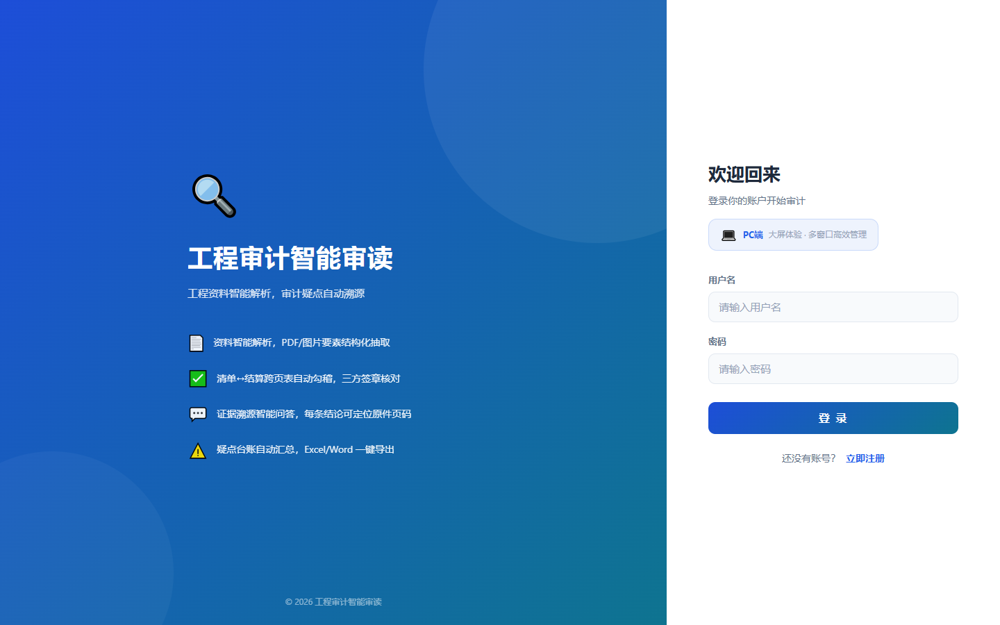
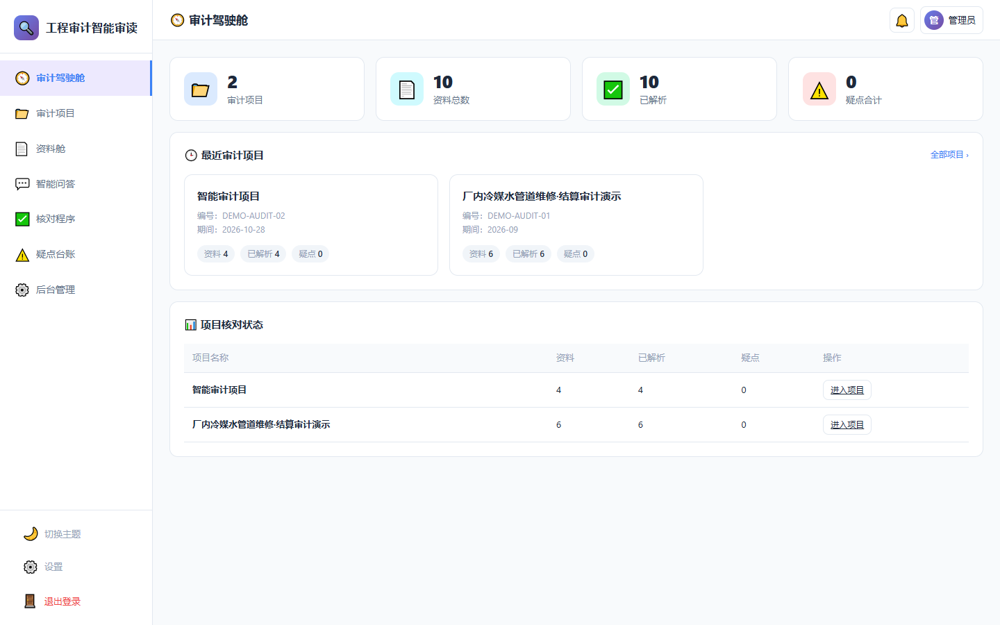
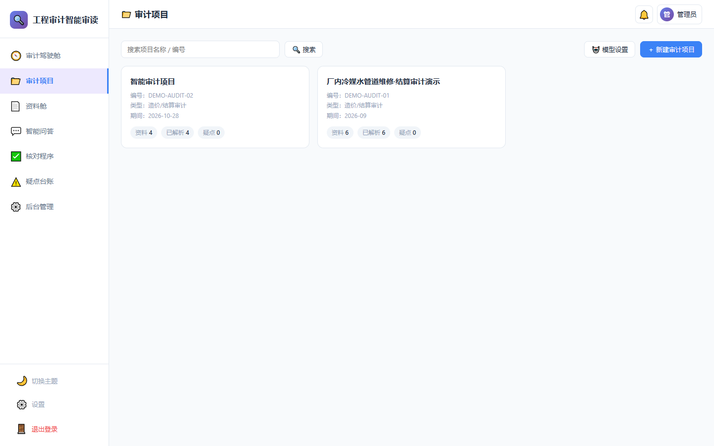
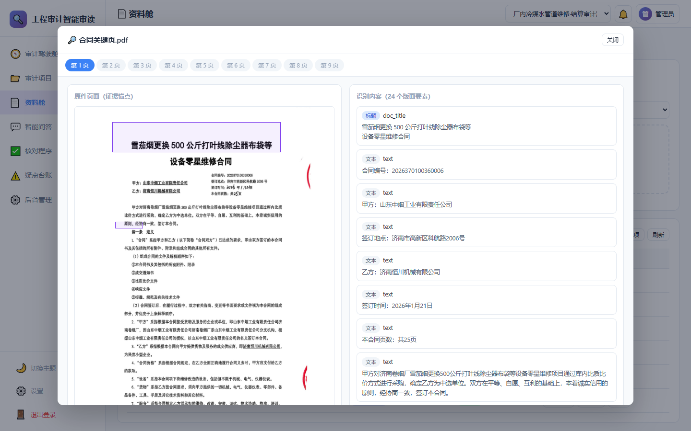
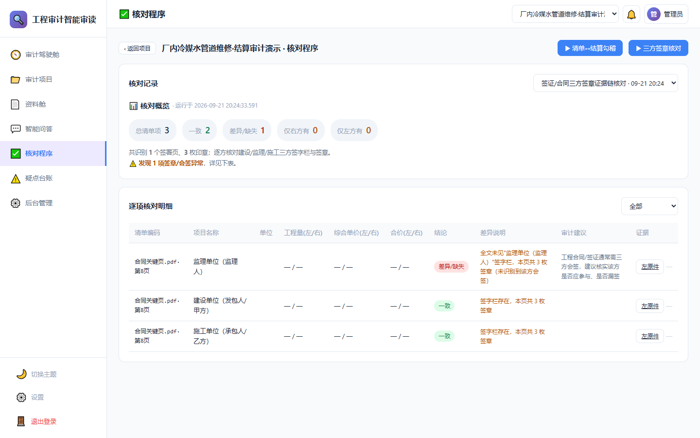
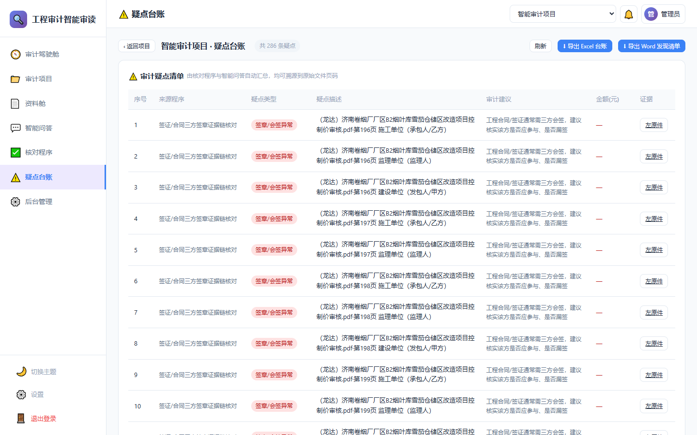
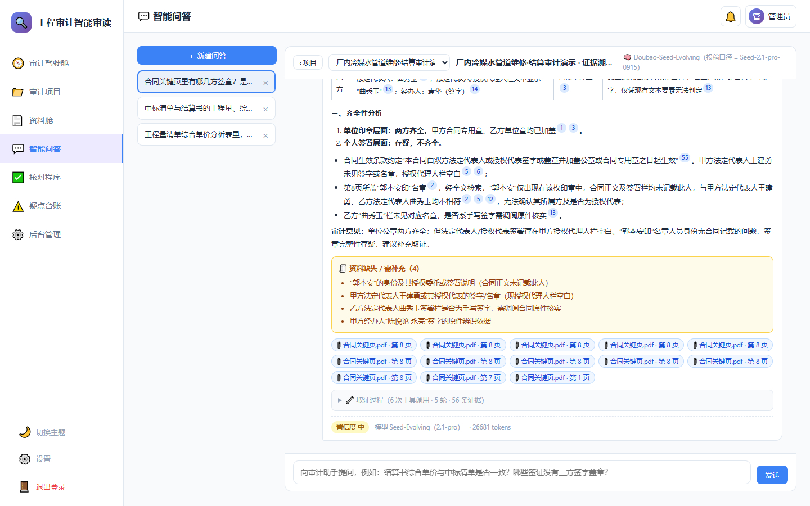

**🌐 Language / 语言:** [中文](README.md) | [English](README.en.md)

# 🔍 Engineering Audit Intelligent Review

> **Intelligent parsing of engineering documents, automatic traceability of audit findings.**
>
> An open-source "intelligent review Agent" for construction-engineering audit scenarios. Upload contracts, tendering documents, bills of quantities, settlement statements, and site visas; the AI automatically extracts structured elements, reconciles cross-page tables, and verifies three-party seals. It supports evidence-traceable Q&A — every conclusion can be traced back to the source page — and findings can be exported to Excel/Word ledgers in one click.
>
> Built-in **🧹 Bid Clearing Analysis**: upload one tender control price document plus the quotation files of N bidders, and get an item-by-item clearing review report (arithmetic errors, unbalanced bidding, omitted/zero-priced items, provisional sums and safety-civilized construction fees, disqualification red lines, etc.) that can be used directly for bid evaluation.

---

## 🌐 Live Demo & Source Code

| Item                    | Details |
|-------------------------|---------|
| 🚀 Live Demo            | https://ai-audit.xunnan.net/pc/index.html |
| 👤 Demo Account         | `admin` / `123456` |
| 📦 Source Code （Github） | https://github.com/xiangxiang088/ai-smart-audit |
| 📦 Source Code （Gitee）  | https://gitee.com/xiangxiang088/ai-smart-audit |

> Please do not change the admin password so others can enjoy the demo too. Thank you for your support!

---

## 📖 Introduction

### What is it?

**Engineering Audit Intelligent Review** is a full-stack, privately deployable engineering-audit assistant. It frees auditors from "page-by-page reading, manual transcription, and hand-made reconciliation," letting AI handle structured parsing and preliminary checks while auditors focus on professional judgment and finding review.

The overall workflow:

```
  Upload  →  Intelligent Parsing (OCR)  →  Structured Elements  →  Auto Checks / Traceable Q&A  →  Findings Ledger  →  Report Export
 PDF / Image     PaddleOCR-VL             Tables / Seals / Text   Reconciliation · Seals           Excel / Word

 Bid Clearing:  1 tender control price + N bid quotations  →  Parse & Store  →  Item-by-item Review  →  Markdown Report
```

| Module | Description |
|--------|-------------|
| 🧭 Audit Cockpit | Global statistics, quick resume of recent projects, project-check status overview |
| 📁 Audit Projects | Multi-project management; each card is a project-context entry |
| 📄 Document Vault | Upload/parse/view contracts, tendering docs, BOQ, settlement, visas, etc. |
| ✅ Check Procedures | Automatic BOQ↔settlement cross-page reconciliation and three-party seal verification |
| 💬 Intelligent Q&A | Evidence-traceable questions; the Agent gathers evidence across multiple turns and cites source pages |
| ⚠️ Findings Ledger | Automatically aggregates reconciliation differences and seal anomalies; one-click Excel/Word export |
| 🧹 Bid Clearing | Item-by-item comparison of a tender control price against multiple bid quotations, producing a clearing review report (standalone, no project binding required) |
| 🤖 Model Config | Visual configuration of the audit brain: call order, enable/disable, per-model and whole-chain timeouts, connectivity test |

### Why build it?

Traditional engineering audit has long faced three pain points:

- **Thick documents, tedious transcription**: Contracts, BOQ, and settlement for a single project can run hundreds of pages; key amounts, dates, and seals must be located and copied by hand.
- **Complex, error-prone reconciliation**: BOQ vs. settlement and visas vs. contracts require repeated cross-page, cross-file checking — time-consuming and easy to miss.
- **Hard-to-trace conclusions**: After finding an issue, auditors must dig through massive source files for evidence; working-paper and ledger preparation is repetitive.

This project uses an "OCR eyes + Agent brain" to automate the mechanical work, making audit conclusions **verifiable, traceable, and exportable**.

### Core Capabilities

- [x] Intelligent parsing of PDF/image documents; structured extraction of tables, seals, and text
- [x] Automatic BOQ ↔ settlement cross-page reconciliation, with item-by-item amount/quantity difference flags
- [x] Three-party (construction owner, contractor, supervisor) seal and completeness verification for contracts/visas
- [x] Evidence-traceable Q&A with multi-turn evidence gathering; every conclusion points to the source page
- [x] Automatic findings ledger aggregation with one-click Excel/Word export
- [x] **Bid clearing analysis**: 12 categories of item-by-item checks — arithmetic errors, unbalanced bidding, omitted/zero-priced items, provisional sums, safety-civilized construction fees, disqualification red lines, and more
- [x] **Configurable models**: adjustable call-chain order, per-model enable/disable, timeouts and failover policy — all from the UI
- [x] Globally remembers the current audit project; switch between projects at any time
- [x] Full RBAC, JWT authentication, rate limiting, and security hardening

---

## 🖼️ Screenshots

### 🔐 Login
Branded login page with account registration; a pure PC product experience.



### 🧭 Audit Cockpit
Four key statistics — projects, documents, parsed, findings — at a glance, with quick resume of recent projects.



### 📁 Audit Projects
Multi-project card management; click a card to enter that project's context.



### 📄 Document Vault
Upload and parsing status at a glance; the source viewer can highlight table/title regions.



### ✅ Check Procedures
BOQ↔settlement cross-page reconciliation and three-party seal verification results, presented by category.



### ⚠️ Findings Ledger
Automatically aggregates differences and seal anomalies; supports one-click Excel/Word export.



### 💬 Intelligent Q&A
After multi-turn evidence gathering, the Agent gives conclusions with evidence citations and source pages, and explicitly lists missing materials.

**Fully streamed end to end**: the whole Q&A flow runs over SSE, pushing evidence-gathering progress (which round, which tool was called, how many pieces of evidence found, elapsed time) and the drafted answer to the browser in real time. The first sign of progress appears within **~100 ms**, so users no longer wait for the entire run to finish. The answer text is **stripped from the model's JSON-constrained output on the fly** by the server — users never see the `{"answer":"…"}` wrapper, nor half-finished escape sequences such as `\u4e2`. An SSE heartbeat keeps the connection alive during long model thinking, and if the network drops, the frontend automatically re-fetches the latest persisted result.



---

## 🏗️ Technical Architecture

### Separated "Eyes" and "Brain"

```
┌──────────────────────────────────────────────────────────────┐
│                     PC Frontend (Browser)                     │
│   Vanilla HTML / CSS / JS, no framework, no bundler           │
│   Served as static files by Express                           │
└───────────────────────────────┬──────────────────────────────┘
                                 │ JWT + REST API
┌───────────────────────────────▼──────────────────────────────┐
│                    Node.js + Express Backend                   │
│                                                                │
│   ┌──────────────────┐         ┌───────────────────────────┐  │
│   │   👁️ Eyes: OCR     │         │   🧠 Brain: Audit Agent     │  │
│   │  PaddleOCR-VL 1.6 │         │  doubao-seed-evolving      │  │
│   │  Official cloud API│ Struct. │  (Seed-2.1-pro)           │  │
│   │  Tables/seals/text │ ─────→  │  Planning · tool calls ·   │  │
│   └──────────────────┘ elements │  cross-file verification   │  │
│                                │  Traceable Q&A · findings   │  │
│                                └───────────────────────────┘  │
│                                        │                       │
│                                 mysql2 pool                    │
└────────────────────────────────────────┼───────────────────────┘
                                         ▼
                              MySQL 8.0 (5.7 compatible)
```

- **Eyes (OCR)**: Baidu AI Studio **PaddleOCR-VL 1.6** official cloud API, which converts PDF/images into structured elements such as tables, seals, and text. The model only sees "images" and outputs structured JSON.
- **Brain (Agent)**: Volcano Ark **doubao-seed-evolving (Seed-2.1-pro)**, which performs planning, function-call evidence gathering, cross-file verification, traceable Q&A, and finding judgment based on structured elements. **The brain never directly receives images**, ensuring conclusions are structured and traceable.
- **Model failover**: brain calls are attempted in order — "primary → backup → fallback" — switching to the next only when the previous one fails (rate limit / arrears / timeout / service error). **Call order, enable/disable state, and per-model and whole-chain timeouts are all adjustable on the "🤖 Model Config" page, taking effect immediately without code changes.** Long reports always use **streaming output** — non-streaming requests send nothing while the model is thinking, so an intermediate proxy may cut the connection on an idle timeout.

### Tech Stack

| Layer | Technology |
|-------|-----------|
| Frontend | Vanilla HTML / CSS / JavaScript; no Vue/React, no bundler |
| Backend | Node.js + Express, mysql2 connection pool |
| Database | MySQL 8.0 (5.7 compatible), Snowflake ID primary keys, `del_flag` soft delete |
| OCR (Eyes) | PaddleOCR-VL 1.6 official cloud API (AI Studio) |
| Agent (Brain) | doubao-seed-evolving / Seed-2.1-pro (Volcano Ark) |
| Model Failover | primary → backup → fallback chain, streaming output, order/enable/timeouts configurable (DB-driven, no redeploy) |
| Documents | xlsx, docx, mammoth (ledger import/export) |
| Auth / Permissions | JWT + bcryptjs, full RBAC |
| File Upload | Multer, date-organized storage |

---

## 🧹 Bid Clearing Analysis

The most time-consuming mechanical checks in bid evaluation are handed to the AI: upload **one tender control price document + the quotation files of N bidders**, and the system produces an item-by-item Markdown clearing review report ready for evaluation use.

One clearing task = one tender control price + N bidders (each bidder may have multiple quotation files). This feature is **decoupled from audit projects** (`project_id` may be null) and can be used standalone.

**12 categories of checks:**

| Section | Content |
|---------|---------|
| 1. Arithmetic errors | Verify "unit price × quantity = amount" line by line; specifically hunt for tampering such as "unit price 0 but non-zero amount", plus mismatches between the sum of BOQ subtotals and the bid total |
| 2. Code & item-name compliance | Altered codes, names/feature descriptions inconsistent with the tender documents, mismatched units of measurement |
| 3. Safety-civilized construction fee | Whether the rate falls below the mandated minimum (this fee may not be undercut as a competitive item) |
| 4. Provisional sum consistency | Whether provisional sums per discipline are preserved unchanged |
| 5. Main material & equipment prices | Whether prices deviate markedly from the control-price market level |
| 6. Non-substantive response | Schedule commitment, quality standard, over-limit pricing, major omissions/additions |
| 7. Unbalanced bidding | Front-loaded/back-loaded pricing, deviation on items whose quantities may change, with deviation rates and owner risk notes |
| 8. Other issues & advice | Unreasonable measure fees, incorrect levies and taxes, etc. |
| 9. Project-name consistency | Whether the project name matches across the control price and all bid documents |
| 10. Disqualification red lines | Missing items, altered quantities, plus **omitted pricing** (blank unit price) and **zero pricing** (deliberately reported as 0), listed separately |
| 11. Non-standard red-flag zone | Consolidated high-risk items — provisional-sum changes, owner-supplied material anomalies, omissions, zero pricing — tabulated by bidder |
| 12. Bid-pattern analysis | Total-price distribution, unit-price dispersion, pricing gradient (objective statistics only; no collusion conclusions) |

The report ends with a "clearing conclusion summary" table listing each bidder's issue count, risk level (high/medium/low), and overall recommendation.

**Capacity limits**: 40k characters per control price document, 30k per bidder document, 160k in total (excess is truncated).

**Test materials**: the repository ships 3 sets of clearing materials locally (`docs/bid-clearing-samples/`, kept out of version control as they contain generated data), covering item-level / small-scale / total-price scenarios; the control prices and bid totals are real public data, suitable for functional verification.

---

## 🤖 Model Configuration

"Eyes" always use PaddleOCR-VL, while the **audit brain** (bid clearing, intelligent Q&A) runs on a configurable model chain: it tries models **top-down**, moving to the next only when the previous one fails.

Entry: sidebar "🤖 Model Config" (`/pc/ai-model-config.html`, visible to admins). Three tiers ship by default:

| Order | Model | Role |
|-------|-------|------|
| 1 | `doubao-seed-evolving` (Seed-2.1-pro) | Primary, strongest capability |
| 2 | `doubao-seed-2-1-turbo-260628` | Backup 1 |
| 3 | `doubao-seed-2-0-lite-260215` | Backup 2 / fallback |

What the page can do:

| Action | Description |
|--------|-------------|
| ▲▼ Reorder | Change the failover order; move your preferred model up |
| Enable / Disable | Disabling means **fully skipped** — never attempted |
| "Use this model only" | One click to set as primary and turn off failover |
| Per-model / whole-chain timeout | In minutes, preventing "per-model timeout × number of models" from hanging indefinitely |
| 🔌 Test all models | One minimal request per model to verify key / quota / network |
| Effective-order preview | Shows which model is actually tried first, which are skipped, and why |

Configuration is persisted in the **unified configuration center** (`sl_sys_config`, namespace `audit.ai`, key `model_chain`) and **takes effect immediately — no code changes or restart required**. Empty `baseUrl` / `apiKey` fall back to the `ARK_BASE_URL` / `ARK_API_KEY` environment variables.

Implementation notes (all learned the hard way):

- **Long reports must be streamed**: a non-streaming request sends nothing while the model is thinking; in practice an intermediate proxy cut the connection on an idle timeout of roughly 300 seconds (manifesting as `fetch failed`), so the primary model always failed and reports degraded to a weaker model. With streaming, every received chunk resets the idle timer, letting the primary model reliably complete 15-minute-class item-level clearing runs.
- **Failover is recorded**: once degradation happens, the session's `model_info` records "degraded, failed: xxx" and a manual-review notice is placed at the top of the report, so a weak model's "no anomalies found" is never taken at face value.
- **Parsing is serial**: documents are parsed one at a time to avoid rate-limiting the online OCR API, so a large PDF in a batch blocks the others. This is by design.

---

## ⚙️ Unified Configuration Center

System configuration is no longer scattered across per-module tables — it all lives in `sl_sys_config`, partitioned by `namespace`:

| Namespace | Contents | Consumer |
|-----------|----------|----------|
| `audit.ai` | Audit model chain (primary model / fallback order / per-model timeouts / failover) | `utils/audit/arkClient.js` |
| `edu.ai` | Education module AI settings (Zhipu GLM endpoint / key / models) | `routes/education/*` |

Design notes:

- **Types travel with values**: `value_type` ∈ `string` / `number` / `boolean` / `json`, decoded automatically on read — no more `'false'` being truthy.
- **Secrets are masked automatically**: entries with `is_secret=1` are always exposed as `9926****7tad`; only server-side reads see the plaintext. Submitting an empty value means "leave unchanged", so a masked string can never be written back as the real key.
- **Cached per namespace for 30 seconds**, invalidated immediately on write — configuration changes take effect without a restart.
- The original endpoints (`/api/audit/ai-config`, `/api/settings/ai`) remain as **adapters** with unchanged external contracts, so existing pages need no modification.

Unified API (admin only):

| Method | Path | Description |
|--------|------|-------------|
| GET | `/api/admin/config` | List all namespaces with item counts |
| GET | `/api/admin/config/:namespace` | Read a namespace (secrets masked) |
| PUT | `/api/admin/config/:namespace` | Write a namespace; accepts `{ items: [...] }` or `{ key: value }` |
| DELETE | `/api/admin/config/:namespace/:key` | Delete a single key |

---

## 🚀 Quick Start

### Requirements

- Node.js >= 16 (18 LTS recommended)
- MySQL >= 5.7 (8.0 recommended)
- Baidu AI Studio Access Token (OCR): https://aistudio.baidu.com/account/accessToken
- Volcano Ark API Key (Agent): https://console.volcengine.com/ark

### Step 1: Initialize the Database

```bash
mysql -u root -p
```

Run the base schema first, then the audit-module scripts in filename-date order:

```sql
-- 1) Base system tables (users/roles/menus/notifications, etc.)
source /your/path/ai-smart-audit/server/sql/v1.0.x/20260920-db-init-v1.0.x.sql;

-- 2) Engineering audit module (run all, in filename-date order)
source /your/path/ai-smart-audit/server/sql/v1.1.x/20260920-audit-init.sql;                   -- Projects / documents / elements / Q&A / checks
source /your/path/ai-smart-audit/server/sql/v1.1.x/20260920-audit-ai-config.sql;               -- Model config table (data later moves to the config center; table kept as a rollback snapshot)
source /your/path/ai-smart-audit/server/sql/v1.1.x/20260921-audit-admin-rebrand.sql;           -- Admin console audit rebrand (disable education menus)
source /your/path/ai-smart-audit/server/sql/v1.1.x/20260921-audit-cockpit-rebrand.sql;         -- Cockpit rebrand
source /your/path/ai-smart-audit/server/sql/v1.1.x/20260921-audit-bid-clearing.sql;            -- Bid clearing (tasks / bidders / document links + menu)
source /your/path/ai-smart-audit/server/sql/v1.1.x/20260922-audit-model-config-menu.sql;       -- Model config menu
source /your/path/ai-smart-audit/server/sql/v1.1.x/20260922-bid-clearing-decouple-project.sql; -- Decouple bid clearing from projects (project_id nullable)
source /your/path/ai-smart-audit/server/sql/v1.1.x/20260922-remove-edu-menus.sql;              -- Clean up leftover education menus
source /your/path/ai-smart-audit/server/sql/v1.1.x/20260922-unified-config-store.sql;          -- Unified config center (sl_sys_config upgraded to namespaced KV; model chain moved to audit.ai)
```

> These scripts must be executed in order. The default database name is `ai_education`; if you rename it, update both the scripts and environment variables.
>
> You can also run them one by one with the bundled helper (no need to type `source` paths): `cd server && node scripts/exec-sql.js sql/v1.1.x/20260921-audit-bid-clearing.sql`

### Step 2: Configure Environment Variables

```bash
cd server
cp .env.template .env.development
```

Edit `server/.env.development` and fill in the key items:

```env
# Database
DB_HOST=localhost
DB_USER=root
DB_PASSWORD=your_mysql_password
DB_NAME=ai_education

# JWT secret: node -e "console.log(require('crypto').randomBytes(48).toString('hex'))"
JWT_SECRET=replace_with_a_locally_generated_long_random_string

PORT=3003
NODE_ENV=development
ALLOWED_ORIGINS=http://localhost:3003,http://127.0.0.1:3003

# OCR (Eyes): AI Studio Access Token
OCR_KEY=your_aistudio_access_token
OCR_MODEL=PaddleOCR-VL-1.6

# Agent (Brain): Volcano Ark
ARK_API_KEY=your_ark_api_key
ARK_MODEL=doubao-seed-evolving
```

> The server loads files by `NODE_ENV`: production → `.env.production`, development → `.env.development`, unset → `.env`.

### Step 3: Install Dependencies & Start

```bash
cd server
npm install
npm start
```

Windows (PowerShell / CMD) with the development environment:

```powershell
# PowerShell
$env:NODE_ENV="development"; npm start
```
```cmd
:: CMD
cmd /c "set NODE_ENV=development && npm start"
```

Linux / macOS:

```bash
NODE_ENV=development npm start
```

After startup, visit:

- App entry: http://localhost:3003/ (redirects to the login page)
- Default admin: `admin` / `123456`

### How to use it?

**A. Project-scoped document review**

1. Create a project in "📁 Audit Projects" and click to enter it;
2. In "📄 Document Vault", upload PDF/images of contracts / tendering docs / BOQ / settlement / visas and wait for parsing to finish;
3. In "✅ Check Procedures", run BOQ↔settlement reconciliation and three-party seal verification;
4. In "💬 Intelligent Q&A", ask directly, for example:
   - `Which parties sealed the key contract pages? Are they complete?`
   - `What are the quantity and unit-price differences between the BOQ and the settlement?`
   - `Are the visa amounts consistent with the contract? Which page is the evidence on?`
5. In "⚠️ Findings Ledger", review the aggregated results and export Excel/Word.

**B. Bid clearing (standalone, no project binding needed)**

1. Open "🧹 Bid Clearing" and click "+ New Clearing Task" to name it;
2. Upload the clearing materials (one tender control price + each bidder's quotation files; Excel / PDF / Word all supported) and wait for parsing;
3. Designate which document is the **tender control price**;
4. Add each bidder, fill in the company name, and attach their quotation file;
5. Once the page shows "ready to analyze", click "Start Clearing Analysis" and wait for the Markdown report;
6. The report is organised by the 12 check categories — each section gives a conclusion first, then detail tables (item code, bidder, amount difference, deviation rate, risk level).

> Clearing materials **do not occupy an audit project** and can be used standalone. Three additional sets of test materials are kept locally in `docs/bid-clearing-samples/` (not under version control).

**C. Model configuration**

Open "🤖 Model Config" to adjust the model call order, enable/disable models, set timeouts, and test connectivity — see the "🤖 Model Configuration" section above.

---

## 🐧 Linux Production Deployment

PM2 is recommended to keep the process alive:

```bash
npm install -g pm2
cd server
NODE_ENV=production pm2 start server.js --name ai-smart-audit --env production
pm2 save && pm2 startup
```

Or use systemd (`/etc/systemd/system/ai-smart-audit.service`):

```ini
[Unit]
Description=AI Smart Audit
After=network.target mysql.service

[Service]
Type=simple
WorkingDirectory=/opt/ai-smart-audit/server
ExecStart=/usr/bin/node /opt/ai-smart-audit/server/server.js
Environment=NODE_ENV=production
Restart=always
RestartSec=5
User=www-data

[Install]
WantedBy=multi-user.target
```

```bash
sudo systemctl daemon-reload
sudo systemctl enable --now ai-smart-audit
```

Nginx reverse proxy (raise the upload size limit — audit PDFs are often large):

```nginx
server {
    listen 80;
    server_name your.domain.com;

    client_max_body_size 100m;

    location / {
        proxy_pass http://127.0.0.1:3003;
        proxy_set_header Host $host;
        proxy_set_header X-Real-IP $remote_addr;
        proxy_set_header X-Forwarded-For $proxy_add_x_forwarded_for;
        proxy_set_header X-Forwarded-Proto $scheme;
        proxy_read_timeout 300s;
    }
}
```

For production, make sure you have created `.env.production` — the `.env*` files are all listed in `.gitignore`
and are not deployed with the code. The easiest path is `cp .env.production.example .env.production`, then fill in values.

`ALLOWED_ORIGINS` **can usually be left empty**: the frontend calls the backend through a relative path (`/api`),
so requests are same-origin, and the server allows same-origin requests automatically. Changing the domain,
changing the IP, enabling HTTPS, or putting Nginx in front requires no change here.
Only a genuinely split deployment (frontend on domain A, API on domain B) needs the frontend origin registered —
glob subdomains are supported:

```ini
ALLOWED_ORIGINS=https://audit.example.com,https://*.example.com
```

### Post-deployment self-check

One command reveals the configuration actually in effect and verifies CORS behaviour:

```bash
cd server && node scripts/check-deploy.mjs --host=your.domain.com
```

It reports which env file was loaded, whether key variables are empty, whether the port is listening,
and simulates same-origin / cross-origin / glob / preflight requests with a pass-or-deny verdict for each.

### Troubleshooting: login fails with `Not allowed by CORS`

This is a **deployment configuration problem**, not a business error — the request origin was not allowed,
so the server rejected it before it ever reached the application logic:

| Symptom | Cause | Fix |
|---|---|---|
| Login breaks after a domain / HTTPS change | Same-origin requests were being checked against the whitelist | Upgrade to a build with same-origin allow, then restart |
| Self-check reports "same-origin request denied" | The process is still running the old code | Restart the service |
| Frontend and backend are genuinely split | Frontend origin not registered | Register it in `ALLOWED_ORIGINS`; `*.example.com` is supported |

> One more easy trap: `NODE_ENV` decides which env file gets loaded. When starting via PM2 / systemd, pass it as a
> **start argument** (`--env production` / `Environment=NODE_ENV=production`) — putting it only inside the file does
> nothing, since the choice of file depends on it. When config appears not to apply, first check the
> `⚙️ 环境文件:` and `🌐 CORS:` lines in the startup log.

---

## 📁 Project Structure

```
ai-smart-audit/
├── server/                              # Backend
│   ├── server.js                        # Express entry: routes/security/rate limiting/static
│   ├── db.js                            # MySQL connection pool
│   ├── package.json
│   ├── .env.template                    # Environment template (development)
│   ├── .env.production.example          # Environment template (production: CORS / proxy / secrets)
│   ├── sql/
│   │   ├── v1.0.x/20260920-db-init-v1.0.x.sql   # Base system tables
│   │   └── v1.1.x/                              # Engineering audit module (run in filename-date order)
│   │       ├── 20260920-audit-init.sql          # Projects/documents/elements/Q&A/checks
│   │       ├── 20260920-audit-ai-config.sql     # Model config table
│   │       ├── 20260921-audit-bid-clearing.sql  # Bid clearing (tasks/bidders/document links)
│   │       ├── 20260922-audit-model-config-menu.sql        # Model config menu
│   │       ├── 20260922-bid-clearing-decouple-project.sql  # Decouple bid clearing from projects
│   │       └── 20260922-unified-config-store.sql          # Unified config center (namespaced KV)
│   ├── routes/
│   │   ├── admin-config.js              # Unified config center API (namespaced read/write)
│   │   └── audit/                       # Audit routes
│   │       ├── projects.js              # Projects
│   │       ├── documents.js             # Documents
│   │       ├── aiConfig.js              # Model config
│   │       ├── bidClearing.js           # Bid clearing
│   │       ├── chat.js                  # Intelligent Q&A
│   │       └── checks.js                # Check procedures / ledger export
│   ├── utils/
│   │   ├── configStore.js               # Namespaced config store (type decode / secret masking / cache)
│   │   └── audit/
│   │       ├── arkClient.js             # Volcano Ark client: model chain / failover / streaming
│   │       ├── parse/                   # OCR client and parsing service (Eyes)
│   │       ├── chat/                    # Agent orchestration and tool calls (Brain)
│   │       ├── bidclearing/             # Bid-clearing service and expert prompt
│   │       └── check/                   # Reconciliation / seal verification
│   └── scripts/
│       ├── exec-sql.js                  # SQL script runner
│       ├── check-deploy.mjs             # Deploy self-check (env file / key vars / CORS behaviour)
│       ├── e2e-bid-clearing.mjs         # Bid-clearing end-to-end test
│       ├── verify-model-config.mjs      # Model-config API regression test
│       └── verify-config-store.mjs      # Unified config center API regression test
│
├── pc/                                  # PC frontend (vanilla HTML/CSS/JS)
│   ├── login.html                       # Login / Register
│   ├── index.html                       # Audit Cockpit
│   ├── audit-project.html               # Audit Projects
│   ├── audit-documents.html             # Document Vault
│   ├── audit-chat.html                  # Intelligent Q&A
│   ├── audit-checks.html                # Check Procedures
│   ├── audit-findings.html              # Findings Ledger
│   ├── audit-bid-clearing.html          # Bid Clearing
│   ├── audit-bid-clearing-detail.html   # Clearing Task Detail
│   ├── ai-model-config.html             # Model Config
│   ├── css/
│   └── js/
│
├── docs/screenshots/                    # Product screenshots
└── docs/bid-clearing-samples/           # Bid-clearing test materials (3 sets)
```

---

## 🤝 Contributing

Issues and Pull Requests are welcome:

1. Fork the repository and clone it locally;
2. Create a branch from `master`: `git checkout -b feature/your-feature`;
3. Commit your changes following the existing code style (vanilla JS, no bundler);
4. Push the branch and open a Pull Request on Gitee, clearly describing the change and its purpose.

When filing an issue, please include: reproduction steps, expected vs. actual behavior, environment (Node/MySQL versions), and relevant logs.

---

## 📞 Contact

Questions or partnership inquiries? Reach the developer:

- WeChat Official Account: **正在走向自律1** (ID: `xiaobawang114AI`)


---

## 📄 License

This project is released under the [Apache License 2.0](LICENSE). For commercial use and redistribution, please comply with the license terms and retain the original copyright and license notice.
